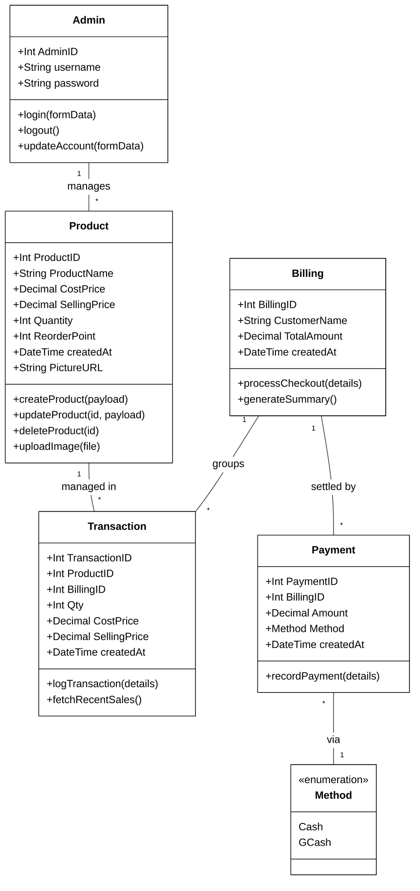

# Vape-Shop System Architecture

### Figure 1: Class Diagram

The diagram represents the system’s structure and relationships between the administrative users and the inventory management components of the Vape Shop. The **Admin** serves as the primary role, responsible for managing product metadata, stock levels, and session security (login/logout). The system architecture centers around the lifecycle of a sale, from product management to the final billing and payment processing.

The **Product** class contains details of inventory items, including cost and selling prices, quantities, and reorder points. When a sale is processed, the system creates **Transaction** records that capture the exact state of products at the time of purchase, grouped under a **Billing** session. This session is finalized through **Payment** entries (using methods like Cash or GCash), ensuring clear financial tracking and automated reporting. Overall, the diagram shows how the system efficiently manages inventory, sales, and financial records for the vape shop.

---

### Downloadable Image

*You can right-click the image above and select "Save Image As..." to download it with a clear white background.*

---

### Technical Mermaid Schema

